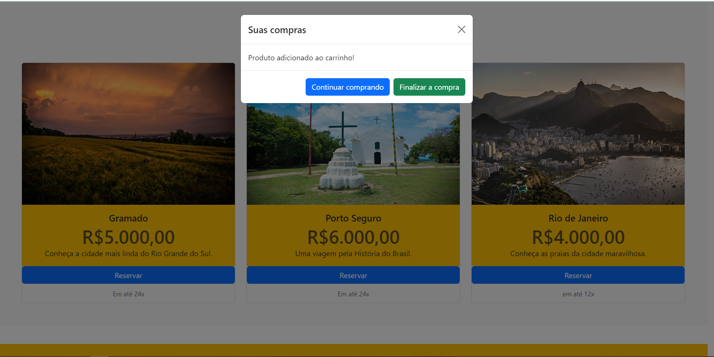

<h1>Site de viagens</h1>

  

## 🚀 Tecnologias

Esse projeto foi desenvolvido com as seguintes tecnologias:

- HTML e CSS
- Bootstrap

## 💻 Projeto

Projeto de site de viagem, desenvolvido durante o MBA Web 3.0 Descomplica.
